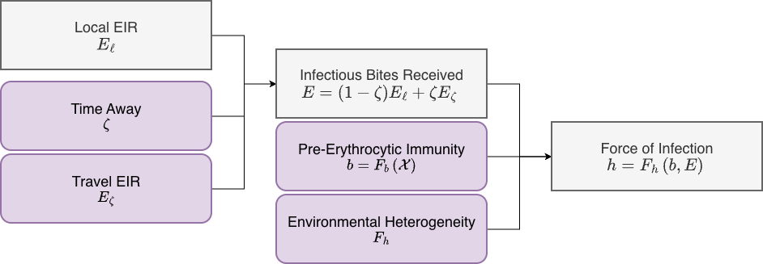

# Exposure

The model for the force of infection (FoI), the rate of infection by
stratum (called \\h\\ or `foi`) is computed from

- the local daily EIR, which is computed by the [transmission
  interface](https://dd-harp.github.io/ramp.xds/articles/Transmission.md)

- the *time away* parameter, \\\zeta\\ (see the discussion in the [blood
  feeding
  interface](https://dd-harp.github.io/ramp.xds/articles/BloodFeeding.md))

- a model for pre-erythrocytic immunity, the probability of an infection
  per infectious bite that could use information from **XH** component.

  - By default, \\F_b\\ returns a constant \\b\\

  - Alternatives are defined in various **XH** modules

- a model for environmental heterogeneity, which assumes that \\E\\ is
  the mean rate of exposure, but in each one of these homogenous strata,
  the expectation could have a distribution. For example, if the
  expectation has a *gamma* distribution, then the expected number of
  bites per person would follow a negative binomial distribution.

  - By default, \\F_h\\ returns \\bE,\\ consistent with a Poisson model
    of exposure.

  - Alternative models pass the method name as the first argument to
    `setup_exposure`

