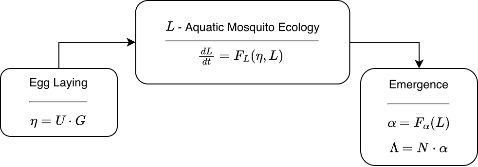

# The L Component

The **L** component was designed to model aquatic mosquito ecology. This
vignette takes an overview of the functions in the **L** component. It
is useful for anyone who wants to learn more about how the code works.

In context, an **L** module gets the egg laying rate, \\\eta\\ from the
**ML**-interface. It is the dot product of the total mosquito egg laying
rate in a patch \\G\\ and the egg laying matrix \\U\\ (Figure 1). The
core functions compute either

- `xde` — a set of derivatives, generically denoted \\dL/dt\\

- `dts` — a function that updates the state variables.

It outputs the habitat emergence rate \\\alpha,\\ the number of adult
female mosquitoes emerging from a patch, per day.

------------------------------------------------------------------------

**Figure 1** - A diagram of the **L** Component in context

------------------------------------------------------------------------

## Functions

To get a list of the `S3` generic function definitions from help, type:

    ?L_functions

To inspect a method for a specific function, use `getS3method`

------------------------------------------------------------------------

The **L** Component defines 16 S3 generic functions in
[aquatic-L.R](https://github.com/dd-harp/ramp.xds/blob/main/R/aquatic-L.R).
Most of these are `S3` class functions, but a few work generically. Each
module defines two functions to set up an **L** object.

The required functions deal with various tasks required to build or
solve a model, inspect or change the parameters or initial values,
compute terms or outputs, and run consistency checks.

Each module is defined by a string, generically called `Lname`, that
identifies the module: *e.g.* `basicL`.

### Dynamics

At least one of the following is required, depending on whether the
model family is a system of differential equations or a discrete time
system:

- `dLdt.Lname` :: differential equations are defined by a function that
  computes the derivatives. In `ramp.xds` these are encoded in a
  function called `dLdt`. The function is set up to be solved by
  [`deSolve::ode`](https://rdrr.io/pkg/deSolve/man/ode.html) or
  [`deSolve::dede`](https://rdrr.io/pkg/deSolve/man/dede.html).

- `Update_Lt.Lname` :: discrete time systems are defined by the function
  that updates the state variables in one time step. In `ramp.xds` these
  are encoded in a function called `Update_Lt` that computes and returns
  the **state variables.** The forms mimic the ones used for
  differential equations.

### Bionomics

Two functions update bionomic parameter values at each time step, called
in sequence before the dynamics are computed.

- `LBionomics.Lname` – computes the current bionomic parameter values
  for parameters that are ports. It also resets all effect sizes to 1.

- `LEffectSizes.Lname` – applies vector control effect sizes to the
  bionomic parameters set by `LBionomics`.

### Output Terms

These functions compute dynamical terms – the outputs passed to an
interface.

- `F_emerge.Lname` - the function computes the habitat specific
  emergence rate, \\\alpha\\

## Model Object

Each module has a pair of functions that set up a structured list called
the **L** model object, or `L_obj`.

The object is a list that is assigned to a `class` that dispatches the
`S3` functions described below. It is a compound list, where some of the
sub-lists are assigned their own `class` that dispatch other `S3`
functions.

- `setup_L_obj.Lname` is a wrapper that calls `make_L_obj_Lname` and
  (for the \\i^{th}\\ species) attaches the object as
  `xds_obj$L_obj[[i]]`

- `make_L_obj_Lname` :: returns a structured list called an **L** model
  object:

  - `class(L_obj)` = `Lname`

  - the indices for the model variables are stored as `L_obj$ix`

  - the initial values are stored as `L_obj$inits`

  - bionomic parameter values

  - anything else that is needed can be configured here

In some cases, bionomic parameters are set up as ports (see
\[xds_info_port\]); the value is set by a call to a function.

### Parameters

- `get_L_pars.Lname` returns a named list of the parameter values.

- `change_L_pars.Lname` changes the values of some parameters by passing
  a named list. It is designed to be used after setup. New parameter
  values are passed by name in a list called `options`.

### Variables

Since the **L** component is one of three, a function sets up the
indices for all the variables in a model.

Two other functions use those indices: one pulls the variables from the
state variable vector \\y\\; the other one pulls the variables by name
from an output matrix returned by `xds_solve`.

After pulling, both functions return the variables by name in a list to
make it easy to inspect or use.

- `setup_L_ix.Lname` - is the function that assigns an index to each
  variable in the model, and stores them as a named list at
  `xds_obj$L_obj[[s]]$ix`. The indices can be retrieved with `get_L_ix`.

- `get_L_ix` – returns the indices stored at `L_obj[[s]]$ix`

- `get_L_vars.Lname` - retrieves the value of variables from the state
  variables vector \\y\\ at a point in time and returns the values by
  name in a list; the function gets called by `dLdt` and it can be
  useful in other contexts.

- `parse_L_orbits.Lname` - this function is like `get_L_vars` but it
  parses the matrix of outputs returned by `xds_solve`.

### Initial Values

A set of functions sets up or changes the initial values for the state
variables.

- `setup_L_inits.Lname` - is a wrapper, that gets called by `xds_setup`
  and that calls `make_L_inits_Lname`. The setup `options` are passed to
  overwrite default values. The initial values are stored as
  `L_obj$inits`.

- `make_L_inits_Lname` - each model must include a function that makes a
  set of initial values as a named list. This function does not belong
  to any `S3` class, so it can take any form. The function should supply
  default initial values for all the variables. These can be overwritten
  by passing new initial values in `options`.

- `get_L_inits` – returns the initial values

- `change_L_inits.Lname` - changes the initial values.

### Consistency Checks

Some modules in **`ramp.xds`** or **`ramp.library`** have been included
for various reasons. Not all of those models are capable of being
extended. To help users avoid using models in ways that are not
appropriate, we developed two function classes:

- `skill_set_L.Lname` :: describes model capabilities and limitations

- `check_L.Lname` :: at the end of `xds_setup` and at the beginning of
  `xds_solve,` this function gets run to ensure that some quantities
  have been properly updated, and to see if anything has been added to a
  model that is not in its skill set.

## Solving

Functions to get steady states, orbits, and plot outputs:

- `get_L_orbits` – retrieves the saved, parsed orbits for the **L**
  component from an **`xds`** object

- `steady_state_L.Lname` :: pass the egg laying rate and compute steady
  states for the **L** component.

- `xds_plot_L` is a wrapper that calls `xds_lines_L`

- `xds_lines_L` plots larval density
