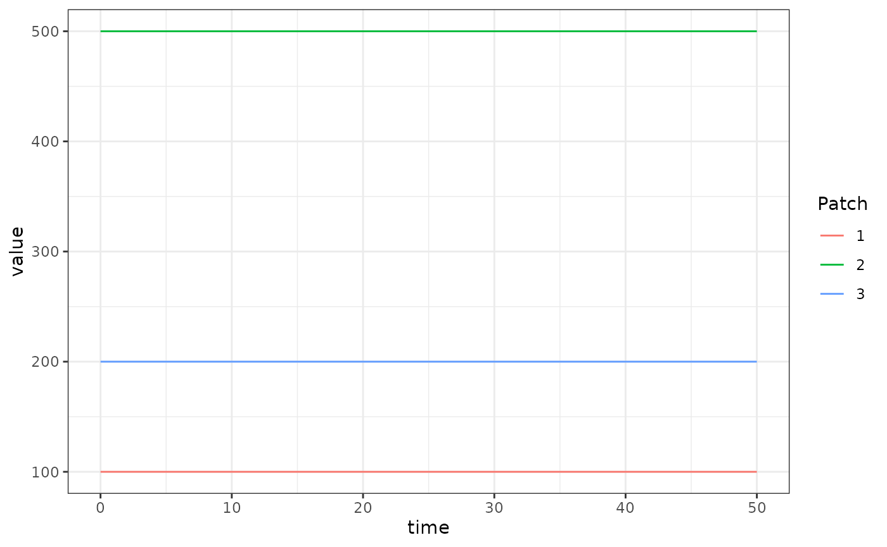

# Basic L

The basicL_xde competition aquatic mosquito model fulfills the generic
interface of the aquatic mosquito component. It has a single compartment
“larvae” for each aquatic habitat, and mosquitoes in that aquatic
habitat suffer density-independent and dependent mortality, and mature
at some rate \\\psi\\.

## Differential Equations

Given \\\Lambda\\ and some egg laying rate from the adult mosquito
population we could formulate and solve a dynamical model of aquatic
mosquitoes to give that emergence rate. However, in the example here we
will simply use a trivial-based (forced) emergence model, so that
\\\Lambda\\ completely specifies the aquatic mosquitoes.

The simplest model of aquatic (immature) mosquito dynamics with negative
feedback (density dependence) is:

\\ \dot{L} = \eta - (\psi+\phi+\theta L)L \\

Because the equations allow the number of larval habitats \\l\\ to
differ from \\p\\, in general the emergence rate is given by:

\\ \Lambda = N \cdot \alpha \\

Where \\N\\ is a \\p\times l\\ matrix and \\\alpha\\ is a length \\l\\
column vector given as:

\\ \alpha = \psi L \\

## Equilibrium solutions

In general, if we know the value of \\\Lambda\\ at equilibrium we can
solve for \\L\\ directly by using the above two equations. Then we can
consider \\\theta\\, the strength of density dependence to be unknown
and solve such that:

\\ \theta = (\eta - \psi L - \phi L) / L^2 \\

## Example

``` r
library(ramp.xds)
library(deSolve)
library(data.table)
library(ggplot2)
```

### The long way

Here we run a simple example with 3 aquatic habitats at equilibrium. We
use `ramp.xds::make_parameters_L_basicL_xde` to set up parameters.
Please note that this only runs the aquatic mosquito component and that
most users should read [our fully worked
example](https://dd-harp.github.io/ramp.xds/articles/ex_534.md) to run a
full simulation.

``` r
nHabitats <- 3
nPatches=nHabitats
membership=1:nPatches
params <- make_xds_object_template("ode", "aquatic", nPatches, membership)
```

``` r
alpha <- c(10, 50, 20)
eta <- c(250, 500, 170)
psi <- 1/10
phi <- 1/12
L <- alpha/psi
theta <- (eta - psi*L - phi*L)/(L^2)
Lo = list(eta=eta, psi=psi, phi=phi, theta=theta, L=L)
MYZo = list(MYZm <- eta) 
```

``` r
params$eggs_laid = eta 
F_eta = function(t, pars){
  pars$eggs_laid
}

params = setup_L_obj("basicL", params, 1, Lo)
params = setup_L_inits(params, 1, Lo)
params = setup_MY_obj("trivial", params, 1, MYZo)

params = make_indices(params)
```

``` r
xDE_aquatic = function(t, y, pars, F_eta) {
  pars$terms$eta[[1]] <- F_eta(t, pars)
  dL <- dLdt(t, y, pars, 1)
  return(list(c(dL)))
}
```

``` r
y0 <- get_inits(params, flatten=TRUE) 

out <- deSolve::ode(y = as.vector(unlist(y0)), times = seq(0,50,by=10), xDE_aquatic, parms = params, method = 'lsoda', F_eta = F_eta) 
out1 <- out
```

``` r
colnames(out)[params$L_obj[[1]]$ix$L_ix+1] <- paste0('L_', 1:params$nHabitats)

out <- as.data.table(out)
out <- melt(out, id.vars = 'time')
out[, c("Component", "Patch") := tstrsplit(variable, '_', fixed = TRUE)]
out[, variable := NULL]

ggplot(data = out, mapping = aes(x = time, y = value, color = Patch)) +
  geom_line() +
  theme_bw()
```



### Using Setup

The function `xds_setup_aquatic` sets up a model that includes only
aquatic dynamics, and it is solved using `xds_solve.aqua.` The setup
functions are simpler than `xds_setup` and come with constrained
choices. The user can configure any aquatic model (`trivial` wouldn’t
make much sense), and it uses `trivial` to force egg laying.

We configure the aquatic model: `Lo` is a list with the parameter values
attached.

``` r
Lo = list(
  psi = 1/10, 
  phi = 1/12
)
alpha = c(10, 50, 20)
Lo$L = with(Lo, alpha/psi) 
Lo$theta = with(Lo, (eta - psi*L - phi*L)/(L^2))
```

We use the MYZ model `trivial` to configure egg laying.

``` r
Mo = list(MYZm = c(250, 500, 170))
```

``` r
xds_setup_aquatic(nHabitats=3, Lname = "basicL", Loptions = Lo, MYoptions = Mo) -> aqbasicL_xde
xds_solve(aqbasicL_xde, Tmax=50, dt=10)$output$orbits$deout -> out2
sum(abs(out1-out2)) == 0
```

    ## [1] TRUE
