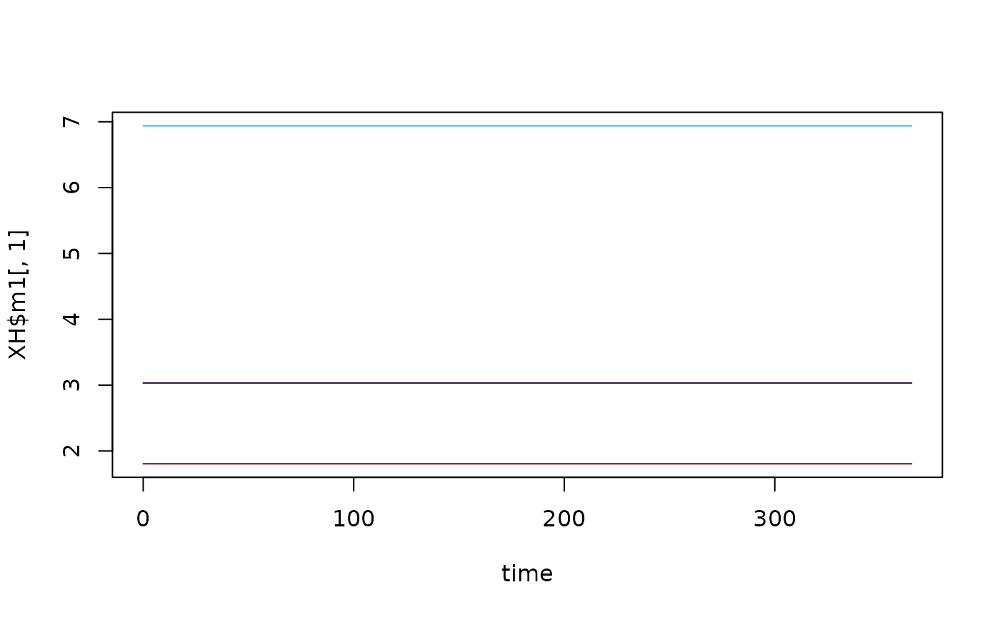

# Hybrid MoI (Multiplicity of Infection) Human Model

This is a hybrid model which tracks the mean multiplicity of infection
(superinfection) in two compartments. The first, \\m1\\ is all
infections, and the second \\m2\\ are apparent (patent) infections.
Therefore \\m2\\ is “nested” within \\m1\\. It is a “hybrid” model in
the sense of [Nåsell
(1985)](https://link.springer.com/book/10.1007/978-3-662-01609-1).

## Differential Equations

The equations are as follows:

\\ \dot{m\_{1}} = h - r\_{1}m\_{1} \\ \\ \dot{m\_{2}} = h - r\_{2}m\_{2}
\\ Where \\h = b EIR\\, is the force of infection. Prevalence can be
calculated from these MoI values by:

\\ x\_{1} = 1-e^{-m\_{1}} \\ \\ x\_{2} = 1-e^{-m\_{2}} \\ The net
infectious probability to mosquitoes is therefore given by:

\\ x = c\_{2}x\_{2} + c\_{1}(x\_{1}-x\_{2}) \\

Where \\c\_{1}\\ is the infectiousness of inapparent infections, and
\\c\_{2}\\ is the infectiousness of patent infections.

## Equilibrium solutions

One way to proceed is assume that \\m\_{2}\\ is known, as it models the
MoI of patent (observable) infections. Then we have:

\\ h = r\_{2}/m\_{2} \\ \\ m\_{1} = h/r\_{1} \\ We can use this to
calculate the net infectious probability, and then \\\kappa =
\beta^{\top} \cdot x\\, allowing the equilibrium solutions of this model
to feed into the other components.

## Example

``` r
library(ramp.xds)
library(deSolve)
library(viridisLite)
```

Here we run a simple example with 3 population strata at equilibrium. We
use `ramp.xds::make_parameters_X_hMoI_xde` to set up parameters. Please
note that this only runs the human population component and that most
users should read [our fully worked
example](https://dd-harp.github.io/ramp.xds/articles/ex_534.md) to run a
full simulation.

We use the null (constant) model of human demography (\\H\\ constant for
all time). While \\H\\ does not appear in the equations above, it must
be specified as the model of bloodfeeding (\\\beta\\) relies on \\H\\ to
compute consistent values.

## The Long Way

Here, we build a model step-by-step.

``` r
nStrata <- 3
H <- c(100, 500, 250)
residence = rep(1,3) 
xds_obj <- make_xds_object_template("ode", "eir", 1, 1, residence)
```

``` r
b <- 0.55
c1 <- 0.05
c2 <- 0.25
r1 <- 1/250
r2 <- 1/50
```

``` r
m2 <- rlnorm(3, .2, .5) 
h <- r2*m2
m1 <- h/r1
Xo = list(b = b, c1 = c1, c2 = c2, r1 = r1, r2 = r2, m1=m1, m2=m2)
```

``` r
eir <- h/b
```

``` r
xds_obj = setup_XH_obj("hMoI", xds_obj, 1, Xo)
xds_obj = setup_XH_inits(xds_obj, H, 1, Xo) 
```

``` r
xds_obj = setup_MY_obj("trivial", xds_obj, 1)
xds_obj = setup_L_obj("trivial", xds_obj, 1)
```

``` r
F_season = function(t){0*t+1}
F_trend = function(t){0*t+1}
F_shock = function(t){0*t+1}
```

``` r
xds_obj$EIR_obj = list() 
xds_obj$EIR_obj$eir <- as.vector(eir)
xds_obj$EIR_obj$scale <- 1 
xds_obj$EIR_obj$F_season <- F_season
xds_obj$EIR_obj$F_trend <- F_trend
xds_obj$EIR_obj$F_shock <- F_shock
xds_obj$EIR_obj$F_age <- F_flat
xds_obj$EIR_obj$season_par <- list() 
xds_obj$EIR_obj$trend_par<- list() 
xds_obj$EIR_obj$shock_par<- list() 
xds_obj$EIR_obj$age_par<- list() 
```

``` r
xds_obj = make_indices(xds_obj)
```

``` r
y0 <- get_inits(xds_obj)
y0
#> $L
#> list()
#> 
#> $MY
#> NULL
#> 
#> $X
#> $X$m1
#> [1] 3.032587 6.938575 1.805443
#> 
#> $X$m2
#> [1] 0.6065175 1.3877150 0.3610886
```

``` r
xds_obj <- xds_solve(xds_obj) 
XH <- xds_obj$outputs$orbits$XH[[1]]
time <- xds_obj$outputs$time
```

``` r
clrs = turbo(5)
plot(time, XH$m1[,1], col = clrs[1], ylim = range(XH$m1), type = "l")
lines(time, XH$m1[,2], col = clrs[2])
lines(time, XH$m1[,3], col =clrs[5])
  
lines(time, XH$m2[,1], col = clrs[1], lty = 2)
lines(time, XH$m2[,2], col = clrs[2], lty=2)
lines(time, XH$m2[,3], col =clrs[5], lty=2)
```



## Using Setup

``` r
xds_setup_eir(eir, Xname="hMoI", HPop=H, XHoptions = Xo) ->test_hMoI
```

``` r
xds_solve(test_hMoI)-> test_hMoI 
XH2 <- test_hMoI$outputs$orbits$XH[[1]]
sum((XH$m1-XH2$m1)^2)
#> [1] 0
```
