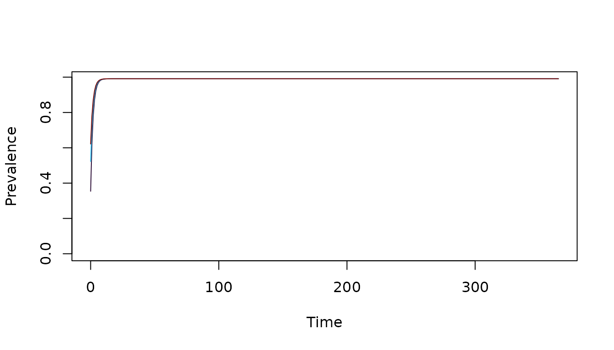

# SIS Dynamics: an XH Module

    Xname = "SIS"

------------------------------------------------------------------------

**CONTENTS:**

- **Basic Dynamics / Basic Setup**

  - the `SIS` comparment model

  - exposure

  - infectiousness

  - diagnostics & detection

  - basic setup

- **A Port: Mass Treatment**

- **Human Demography**

- **The `SIS` Module**

  - variables

  - derivatives

- **Example**

  - using setup

  - another test

  - the long way

------------------------------------------------------------------------

## Basic Dynamics

For the **XH** component, the **SIS** (Susceptible-Infected-Susceptible)
model implements a basic system of differential equations. It is,
perhaps, the simplest model for an endemic pathogen of humans.

------------------------------------------------------------------------


**Fig 1**: A Diagram of the Basic SIS Compartment Model

------------------------------------------------------------------------

### The Compartment Model

A population is subdivided into susceptible (\\S\\) and infected and
infectious (\\I\\) individuals, where the total population is \\H =
S+I.\\

- We let \\h\\ denote the force of infection (FoI).

- We let \\r\\ denote the clearance rate for infections.

The dynamics are described by a pair of equations:

\\ \begin{array}{rl} \dot{I} &= h S - rI \\ \dot{S} &= -hS + rI
\end{array} \\

We note that since, \\S=H-I,\\ if \\H\\ is known, then one of these
equations is redundant, so instead we compute:

\\ \dot{I} = h (H-I) - rI \\

Note that if we introduce a change of variables, \\x = I/H\\, then if
\\dH/dt=0,\\ the system is equivalent to:

\\ \dot{x} = h (1-x) - r x \\

We note that Pull and Grab (1974)[¹](#fn1) fit a model like this to data
describing malaria prevalence by age.

### Exposure

The module handles exposure as part of the standard interface (see
[Exposure](https://dd-harp.github.io/ramp.xds/articles/Exposure.md)). In
a nutshell:

- \\E\\: the daily EIR is computed for each population stratum

- \\b\\ is the probability an infective bite on a human causes an
  infection

- \\h\\ or `foi` : the daily FoI is a dynamical term

  - it is computed in `Exposure` as \\h = F_h(b, E)\\

  - By default, the FoI is linearly proportional to the EIR: \\h = b E\\

For advanced options, see
[Exposure](https://dd-harp.github.io/ramp.xds/articles/Exposure.html%5D)

### Infectiousness

Infected humans are not fully infectious. We assume that the fraction of
bloodmeals on infectious humans that infect a mosquito is \\c,\\ so the
fraction of mosquitoes that become infected after a human blood meal is
\\cI/H.\\ The infectious density is computed as: \\F_I = c I\\

### Diagnostics and Detection

The probability a human would *test positive* is q, so while true
prevalence is \\x=I/H,\\ observed prevalence would be \\qI/H.\\ The
model includes three parameters for detection:

The model is too simple to get any meaningful insights about detection.

### Basic Setup

The following summarizes the math notation (*e.g.* \\b\\), and `name`
and default setup value (*e.g.* `b=0.55`) for the parameters and ports.

- \\b\\ or `b=0.55` is the probability an infective bite on a human
  causes an infection

- \\r\\ or `r=1/180` is the clearance rate

- \\c\\ or `c=0.15` is the probability a blood meal on an infected human
  infects the mosquito

- \\q\\ ix the probability an infected person would test positive. The
  default is to provide *Pf*PR estimates by light microscopy, RDT or
  PCR:

  - `d_lm=0.8` - the probability of detecting parasites by light
    microscopy

  - `d_rdt=0.8` - the probability of detecting parasites by rapid
    diagnostic test

  - `d_pcr=0.9` - the probability of detecting parasites by PCR

``` r
library(ramp.xds)
mod <- xds_setup(Xname = "SIS") 
get_XH_pars(mod)
```

    ## $b
    ## [1] 0.55
    ## 
    ## $c
    ## [1] 0.15
    ## 
    ## $r
    ## [1] 0.005555556
    ## 
    ## $d_lm
    ## [1] 0.8
    ## 
    ## $d_rdt
    ## [1] 0.8
    ## 
    ## $d_pcr
    ## [1] 0.9

------------------------------------------------------------------------

## Mass Treatment

The module includes a port to simulate mass treatment. In the SIS model,
mass treatment increases the clearance rate from \\r\\ to \\r +
\xi(t)\\. After curing an infection, in this model, the humans become
susceptible to infection again.

\\ \dot{I} = h (H-I) - \left(r+\xi\left(t\right)\right) I \\

During basic set up, the function returns no effect: \\\xi(t)=0\\.
Configuring a mass treatment function is handled as an advanced setup
option in `ramp.control` (see [`ramp.control`::Mass
Treatment](https://dd-harp.github.io/ramp.control/articles/MassTreatment.html))

- \\\xi(t)\\ is either called `mda(t)` or `msat(t)`: functions
  implementing mass treatment

  - The function `mda(t)` implements mass drug administration

  - The function `msat(t)` implements mass screen and treat using
    detection parameters (see above)

- Setup for mass treatment is an advanced option in `ramp.control`

To read more, see [`ramp.control`::Mass
Treatment](https://dd-harp.github.io/ramp.control/articles/MassTreatment.html)

## Human Demography

The implementation of the model was generalized to consider human (or
host) vital dynamics. The generalized system thus includes three ports:

- The population birth rate, \\B(t, H)\\

- A constant per-capita rate, \\\mu.\\ The model does not include a
  parameter to describe disease-induced mortality

\\ \dot{H} = B(t, H) - \mu H \\

In `ramp.demog`, we have implemented a generalized system called
*principled stratification* making it possible model aging, migration,
and dynamical exchanges among strata. After setup, all these dynamics
are combined in a single demographic matrix \\D\\. The implementation is
thus more general:

\\ \dot{H} = B(t, H) - D \cdot H \\

By default, the model is implemented with static population dynamics:

- \\B(t,H)\\ or `B(t,H) = 0`: a function describing the population birth
  rate

- \\D\\ or `D_matrix=0,` where \\0\\ is a matrix of zeros.

Other functions can be configured as advanced options in `ramp.demog.`

## The `SIS` Module

### Variables

The module has two variables:

- \\H\\ or `H` is human population density, a vector of length `nStrata`

  - Since human population size, \\H,\\ has effects on the blood feeding
    interface, its value must be assigned during setup as `HPop=...`

  - The parameter `nStrata` is set to `length(HPop)`

  - There is a function to change \\H\\ called `change_H`

- \\I\\ or `I` is the density of infected humans, a vector of length
  `nStrata`

  - The default initial value is \\I=1\\

  - The function to change the initial values of \\I\\ are called by
    `change_XH_inits`

### The Derivatives

The derivatives computed by `dXHdt.SIS` are equivalent to:

\\ \begin{array}{rl} \dot{H} &= B(t, H) - D \cdot H \\ \dot{I} &= h
(H-I) - \left(r+\xi\left(t\right)\right) I - D \cdot I \end{array} \\

------------------------------------------------------------------------

## Example

Here we run a simple example with 3 population strata at equilibrium. We
use `ramp.xds::setup_XH` to set up parameters, and
[`ramp.xds::setup_XH_inits`](https://dd-harp.github.io/ramp.xds/reference/setup_XH_inits.md)
to set the initial values. We configure a `trace` function to force the
EIR.

Interested users should read [our fully worked
example](https://dd-harp.github.io/ramp.xds/articles/ex_534.md).

First, we define the size of three population strata:

``` r
H <- c(100, 500, 250)
nStrata <- length(H) 
```

We use the use the default model of human demography with no births or
deaths.

Next, we define the parameter values for all three strata as a named
list:

``` r
b <- rep(0.55, nStrata) 
c <- rep(0.15, nStrata) 
r <- rep(1/200, nStrata)
```

To use these values to build our model, we create a named list:

``` r
Xo = list(b=b, c=c, r=r)
```

We want to set up the model in a way that tests the software. We want to
set values of the EIR and, knowing what the answer should be, show that
we get them back. First, we set the values of the FoI, and then we
compute the EIR:

``` r
foi = c(1:3)/365 
eir <- foi/b 
```

The equilibrium values we should get back after running the equations to
steady state are \\I = H h /(h+r)\\

``` r
I_eq = H*foi/(foi+r) 
I_eq
```

    ## [1]  35.39823 261.43791 155.44041

First, we use `xds_setup` and next, we do it the long way

### Using Setup

To set up the model, we simply do this:

``` r
xds_setup_eir(eir, Xname="SIS", HPop=H, XHoptions = Xo) -> test_SIS
```

To solve it, we do this:

``` r
xds_solve(test_SIS)-> test_SIS 
```

We plot the prevalence over time:

``` r
clrs = viridisLite::turbo(5)[c(1,2,5)]
xds_plot_PR(test_SIS, clr=clrs)
```


If we set the initial values of \\I\\ to the steady state values, the
variables shouldn’t change at all. To change the values, we simply add
them to the list

``` r
test_SIS <- change_XH_inits(test_SIS, options = list(I=I_eq))
xds_solve(test_SIS)-> test_SIS 
xds_plot_PR(test_SIS, clr=clrs)
```


Or we can use the `get_XH_out` function to get the values of the orbits.
This gets the return values and pulls of the the values of \\I\\ at the
last time step:

``` r
get_XH_out(test_SIS, 1) -> XH2
I_last <- tail(XH2$I, 1)
I_last
```

    ##               4        5        6
    ## [366,] 35.39823 261.4379 155.4404

``` r
sum(tail(XH2$I, 1) - I_eq)
```

    ## [1] 0

### Another Test

If we set \\I(0) = 0\\, the simple model has a closed form solution:

\\ I(t) = H (1-e^{-(h+r) t}) \frac{h}{h+r} \\ We can reset the initial
conditions and solve the system of differential equations:

``` r
test_SIS <- change_XH_inits(test_SIS, options = list(I=rep(0,3)))
xds_solve(test_SIS)-> test_SIS 
Itest = get_XH_out(test_SIS, 1)$I 
xds_plot_PR(test_SIS, clr=clrs)
```



…and we can compute the exact solutions for the same values of \\t\\:

``` r
t = get_XH_out(test_SIS, 1)$time
It = matrix(0, 366, 3)
ss = H*foi/(r+foi)
for(i in 1:3){
  It[,i] = H[i]*(1-exp(-(r[i]+foi[i])*t))*foi[i]/(foi[i]+r[i])
}
```

The summing over all the squared differences is less than \\10^{-6}.\\

``` r
sum((It-Itest)^2) < 1e-6
```

    ## [1] TRUE

------------------------------------------------------------------------

1.  Pull, J. H. & Grab, B. (1974). A simple epidemiological model for
    evaluating the malaria inoculation rate and the risk of infection in
    infants. Bulletin of the World Health Organization, 51(5),
    507 - 516. <https://iris.who.int/handle/10665/260790>
