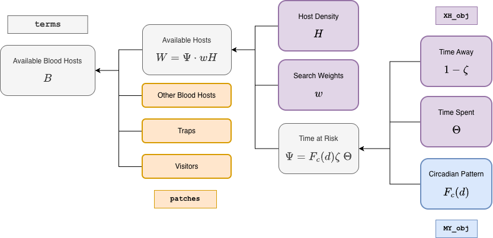

In **`ramp.xds`**, blood feeding is understood as an interaction between mosquitoes and humans. An interface was designed to model blood feeding in a way that was mathematically sound. For most **MY** modules, the default set up option passes the value of bionomic parameters making it possible to build models that are not mathematically sound. Three potential issues are:

+ $f$ is positive when no blood hosts are present;

+ $q \neq 0$ when no humans are present; or

+ $q \neq 1$ when only humans are present


```{r}
library(ramp.xds)
```

**Humans** spend time. The human population density is $H$. 

+ $\Theta$ --- The humans are spending time in places where they might be at risk. In the models, time spent at any point
in time is represented as a matrix. Models for time spent are set up by `setup_timespent`

+ $w$ --- Each human population stratum has a biting weight. Models for biting weights are set up by `setup_blood_search_weights` 

+ $\zeta$ --- Humans sometimes spend time outside the spatial domain. Models for time away are set up by `setup_time_away` 

The interface includes other variables:

+ Other blood hosts --- the availability of other blood hosts is set up by `setup_other_blood_hosts` 

+ Traps --- the availability of traps for blood feeding mosquitoes is set up by `setup_blood_traps`

+ Visitors --- the availability of humans who are not residents of the patch is set up by `setup_visitors` 

**Mosquitoes** search for blood hosts

+ The daily mosquito activity rate is described by a circadian function $F_c(d)$

The mosquito bionomic parameters describing **blood feeding** --- blood feeding rates $f$, the human fraction $q$, and possibly emigration rates, $\sigma$ --- are computed as a function of available resources. We call these *functional responses.*

+ The availability of humans to mosquitoes is called time at risk. It is the activity-weighted time spent. $$\Psi = F_c(d) \zeta \Theta$$ 

+ Mosquitoes search for resources. The total availability of resources is $B$.

+ The blood feeding rate is a function of the total available blood $$f = F_f(t, B(t))$$

+ The human fraction is $$q = F_q(t, V(t), W(t), B(t))= \frac{V+W}{B}$$

+ Emigration is a result of searching for resources, including blood:
$$\sigma = F_\sigma(t, B(t),...)$$

*** 

{width=100%}