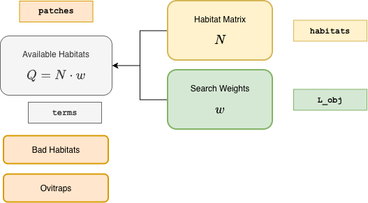

During setup, the location of each habitat is in the patch `membership` vector. From this, the habitat matrix $N$ is created. If $\alpha$ describes emergence of adults from aquatic habitats, then the number emerging per patch is $$\Lambda = N \cdot \alpha$$ 

**Egg Laying** in aquatic habitats is assumed to the outcome of searching: 

+ $w$ --- finding a habitat while searching within a patch is modeled with search weights $w.$ It can be set up using `setup_habitat_search_weights`. 

+ $Q$ --- Availability of habitats, per patch, is a simple sum:$$Q = N\cdot w$$ 

+ $B$ --- The term *habitats* is synonymous with *productive habitats,* or any habitat that could potentially foster development of mosquitoes from egg, through all larval instars and into the pupal stage. A variable is set up to model the availability of **bad habitats,** or any habitat that attracts egg laying adults but that would never produce any adults. It is set to $0$ by default, but it can be set to some other value using `setup_bad_habitats`. 

+ $O$ --- a variable `ovitraps` is also available to simulate traps that attract egg-laying mosquitoes. it is setup by `setup_ovitraps`

The egg laying rates can be set to any value, but the interface makes it possible to compute these rates as a function of available resources:

+ $\nu$ --- the egg laying rate, the number of oviposition events, per adult mosquito,  is a function of all available habitats: $$\nu = F_\nu(Q+B+O)$$ 

+ the fraction of eggs laid in productive habitats is $$\frac{Q}{Q+B+O}$$

+ the fraction of eggs laid in the $j^{th}$ patch by adults that go into the $i^{th}$ habitat in that patch is $$w_i/Q_j$$ 

+ the patch emigration rate may also be related to searching for habitats $$\sigma = F_\sigma(Q, ...)$$ 

***

