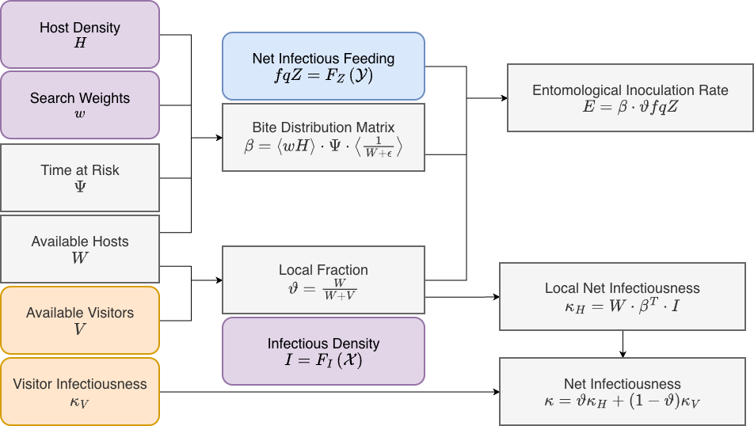

The transmission interface was developed to compute two terms:

+ the daily local entomological inoculation rate (EIR), the number of infective bites, per person in each stratum, per day while *not traveling.* Note that the daily force of infection (FoI) is computed using the [exposure interface](Exposure.html), which can also use information about travel malaria, environmental heterogeneity, and pre-erythrocytic immunity. 

+ the net infectiousness ($\kappa$), the probability a mosquito would become infected after blood feeding on a human.

By design, it uses the same quantities that were defined in the [blood feeding interface.](BloodFeeding.html) 

*** 

{width=100%}