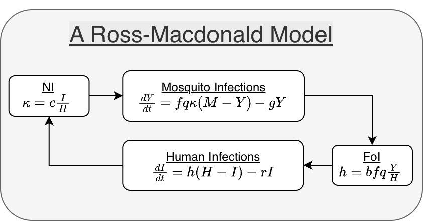
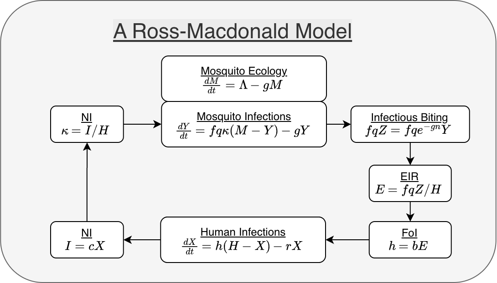

The modular structure for computation implemented in **`ramp.xds`** can be understood by rewriting the equations in **modular form,** a stylized way of presenting a dynamical system that emphasizes the biological agents involved in the underlying process. Here, we rewrite a simple dynamical system in modular form, so the equations mirror the implementation in `ramp.xds`. For a longer discussion and examples, see [Modularity](modularity.html).

## A Standard Form

A mathematical framework for building modular models of malaria dynamics and control (and other mosquito-borne pathogens) was described in [Spatial Dynamics of Malaria Transmission](https://journals.plos.org/ploscompbiol/article?id=10.1371/journal.pcbi.1010684){target="_blank"}, and that framework has been implemented in `ramp.xds`. 

There is no *standard form* for writing down systems of differential equations, but some forms are preferred by scientists or mathematicians, depending on training and context. 

We start by writing one version of a Ross-Macdonald model as a system of equations that does not emphasize the modularity, or *not a modular form* (Box 1).

*** 

**Box 1: A Ross-Macdonald Model** 

+ Let the dependent variable $X(t)$ denote the density of infected humans, and the parameter $H$ the density of humans. 

+ Let the dependent variable $M(t)$ denote the density of mosquitoes, and $Y(t)$ the density of infectious mosquitoes. 

+ Human Infections: 

    + $b$ denotes the fraction of bites by infectious mosquitoes that infect a human; and
     
    + $r$ denotes the rate that infections clear. 

+ Mosquito Ecology: 

    + $\Lambda$ denotes the emergence rate of adult, female mosquitoes;
    
    + $g$ denotes the mosquito death rate; 

+ Mosquito Blood Feeding & Infection Dynamics: 

    + $c$ denotes the fraction of blood meals on infectious humans that infect a mosquito;
    + $f$ denotes the overall blood feeding rate;
    + $q$ denotes the human blood fraction; and
    + $n$ denotes the EIP. 

We introduce a term $Z=e^{-gn}Y$ to model survival through the EIP, such that human infections occur at the rate $fqbZ/H,$ and mosquito infections at the rate $fqcX/H.$

$$ 
\begin{array}{rl}
dX/dt &= fq b e^{-gn} \frac {Y}{H} (H-X) - r X \\
dM/dt &= \Lambda - g M \\ 
dY/dt &= fq c \frac {X}{H} (M-Y) - g Y
\end{array}
$$
Written in this way, it is in a *standard form.*

*** 

## A Modular Form

We illustrate by rewriting this model in its modular form (Figure 1). In the modular form, we identify the terms in one equation that depend on the other variable. First, we focus on the equation describing human infection dynamics. We note that it depends on a term involving the variable $Y.$ The term is called the force of infection (FoI, Ross called it the *happenings* rate). We let $h$ denote the FoI:  

$$h=fq b e^{-gn} \frac {Y}{H}.$$ 

Now, the first equation can be rewritten:  

$$ 
dX/dt = h  (H-X) - r X
$$

Mosquito population dynamics are self-contained. We could model mosquito ecology without infection dynamics, but not *vice versa.* ($M$ appears in $dY/dt,$ but $Y$ does not appear in $dM/dt.$)

$$ 
dM/dt = \Lambda - g M 
$$ 

Mosquito infections depend on the probability a mosquito becomes infected after blood feeding on a human, a term that we will call the net infectiousness (NI or $\kappa$):  

$$\kappa = c\frac{X}{H}$$ 

The force of infection for mosquitoes is $fq\kappa,$ so we can rewrite the equation for parasite infection dynamics in mosquitoes: 

$$ 
dY/dt = fq\kappa (M-Y) - g Y
$$

With these five elements, the system has a modular form. In this modular form, there are three components:

+ **X** - the human SIS model; 

+ **Y** - the mosquito SI model; and

+ **M** - mosquito population dynamics.

There are two dynamical terms: 

+ the FoI, describing parasite transmission from mosquitoes to humans; and 

+ net infectiousness (NI), describing parasite transmission from humans to mosquitoes. 

The modular form is not as compact, but it draws more attention to model structure. The formalism makes it easier to compare different models. 

*** 

{width=100%}

*** 

## Dynamical Terms 

By identifying the dynamical terms --- input involving variables from another module --- it is possible to write the model in a modular form. In **`ramp.xds,`** because the framework handles spatial dynamics, these dynamical terms --- $h$ and $\kappa$ --- are computed as part of an interface that handles blood feeding, transmission, and human exposure in a way that is both flexible and mathematically rigorous.

In the spatial modeling framework, mosquitoes blood feed in patches. Humans reside in a patch, but they spend time in other patches. The interface guarantees that the number of bites and blood meals taken by mosquitoes matches the number of bites and blood meals received by humans. To do this in a flexible way, the interface uses a concept of *available blood hosts.* Part of that interface includes a general way of modeling human *exposure* and *infection,*  including models for travel malaria, partial immunity, and environmental heterogeneity.

We can illustrate using this model without explaining how the full interface works. The FoI is computed in three steps: 

1. compute the total infectious biting rate by the mosquito population, $fqZ = fq e^{-gn}Y;$ 

2. compute the daily entomological inoculation rate (dEIR), the number of infectious bites, per person, per day ($E=fqZ/H$); 

3. compute the FoI, given the EIR ($h=bE$).

The NI is computed in two steps:

1. compute the *infective density* of the human population ($I=cX$).  

2. compute the NI ($\kappa = I/H$).

While these steps add complexity to this simple model, they are essential to the modular implementation that enables richer, more realistic models.

For a longer discussion of modularity, see [Modularity](https://dd-harp.github.io/ramp.xds/articles/modularity.html).

{width=100%}


## Example

Basic setup returns this model during setup, but it can also be configured by naming the modules and passing options to set $\Lambda$:  

```{r, fig.height=4, fig.width=7}
library(ramp.xds)
mod <- xds_setup(Xname = "SIS", MYname = "SI", 
                 Lname = "trivial", Loptions = list(Lambda=80))
```

In solving the system, derivatives for the human "SIS" model are computed by a function `dXHdt.SIS`. Documentation is available through help in two ways: `?SIS` or `?dXHdt.SIS`. The full implementation includes human demography and ports for mass treatment. The code looks like this:  

```{r}
getS3method("dXHdt", "SIS")
```

Derivatives for the mosquito ecology and "SI" model are computed by `dMYdt.SI`. Documentation is available through help in two ways: `?SI` or `?dMYdt.SI`. In the full implementation, a mosquito demographic matrix (called `Omega` or $\Omega$) combines mortality ($g$) and dispersal. The code looks like this:  

```{r}
getS3method("dMYdt", "SI")
```

The term $\Lambda$ is passed from the trace function `F_emerge.trivial`. Documentation is available through help in two ways: `?trivial_L` or `?F_emerge.trivial`. The implementation looks like this:

```{r}
getS3method("F_emerge", "trivial")
```

